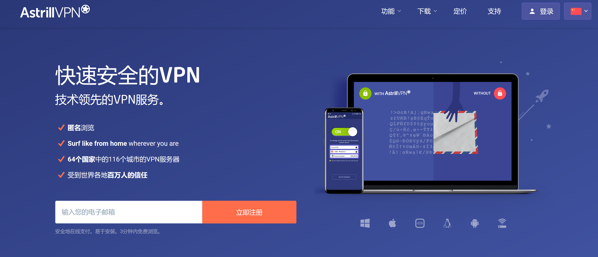
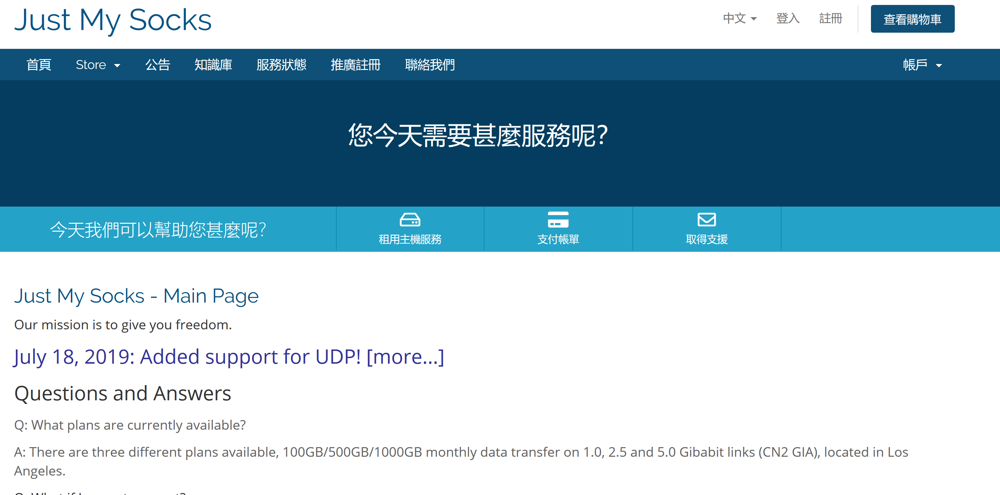
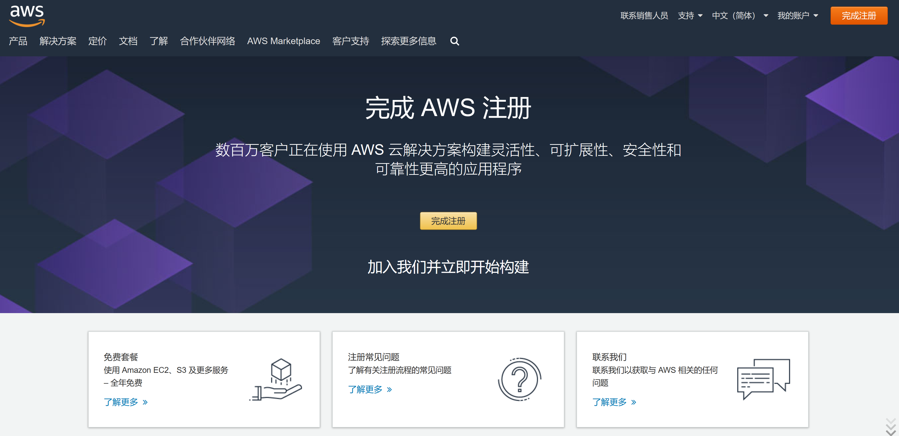
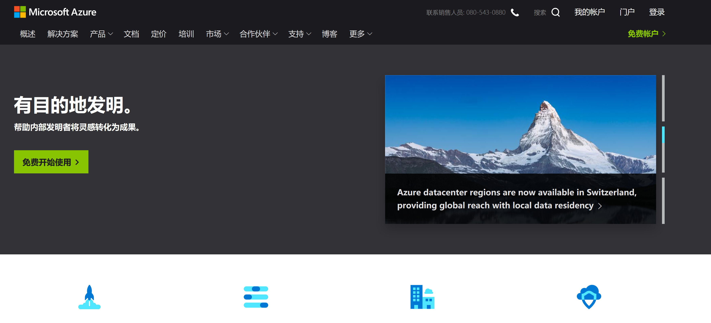
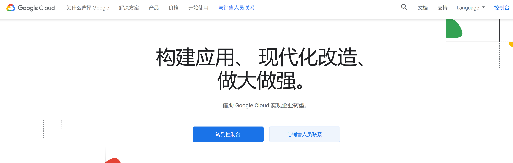

# 简介
本文适用于非专业人士，有翻墙需求的群体。解决无法翻墙、无法稳定翻墙、无法快速稳定翻墙的痛点。

# 自动挡方案
直接购买商业VPN。注意，一般这些网站都会被墙，导致鸡生蛋蛋生鸡的问题，所以可以和朋友借个vpn先，或者用些免费的vpn先上，比如蓝灯。
* Astrill

https://www.astrill.com/, 定价100刀每年

优点：不怕封禁IP，速度快，傻瓜化，有客服

缺点：贵，有设备数量限定

* Justmysocks

https://justmysocks.net/members/, 定价2.8刀每月

优点：不怕封禁IP，速度快，便宜

缺点：有流量限制，有设备数量限定

# 手动挡方案
## 准备一台vps

这个有很多，有免费试用的，也有小厂，有大厂，有的ip不能换，有的ip随便换，有的按限制带宽，有的限制流量，有的什么都不限制，但是按流量收费，可以自由选择。

不过还是推荐选择aws、azure、gcp等平台，这几个都可以随便换ip，防止ip被ban，而且价格其实也不是很贵，因为是正规vps环境，还能干别的事情。而且这几个平台都有免费使用的。

 * aws
 
 https://aws.amazon.com/cn/, 新用户免费用一年
 

* azure

https://azure.microsoft.com/zh-cn/

* gcp

https://cloud.google.com/

## 安装shadowsocks
https://github.com/ziggear/shadowsocks

按照教程按照shadowsocks即可，此时你已经有自己ss的ip、端口、密码等信息。

## 安装shadowsocks客户端
准备ss客户端，连接即可科学上网。客户端很多

https://github.com/shadowsocks/shadowsocks-android

https://github.com/shadowsocks/ShadowsocksX-NG

https://github.com/shadowsocks/shadowsocks-windows

## 安装shadowsocks路由器
有很多支持ss协议的路由器，这样可以在家中所有设备都可以翻墙，比如电视盒子、游戏机等。常见支持的路由器系统比如老毛子、梅林等。

